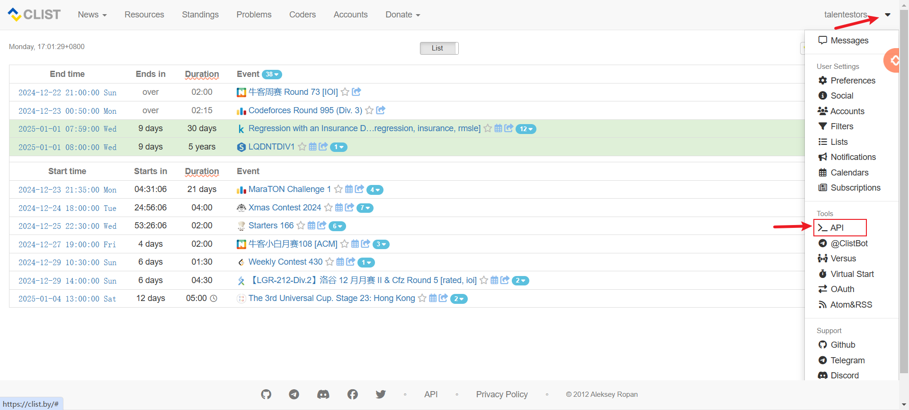
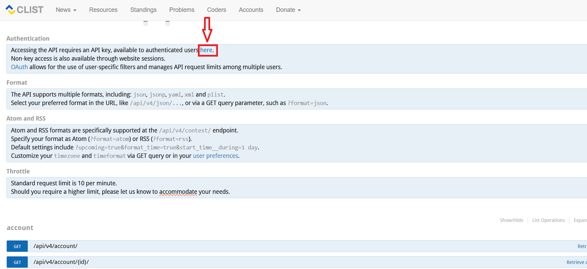
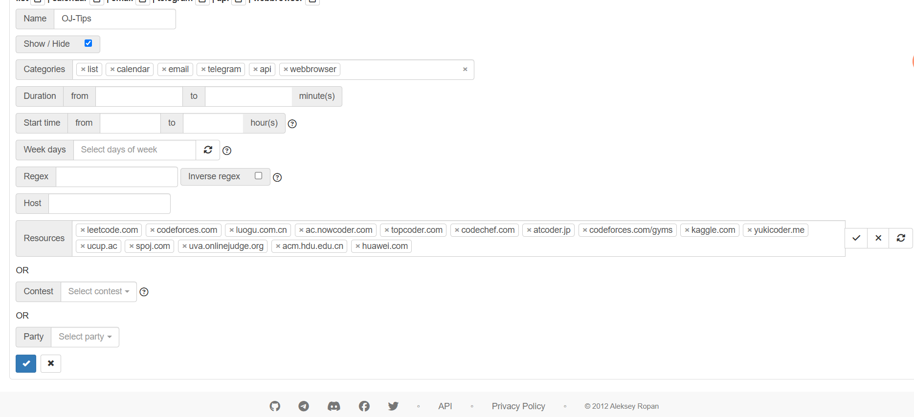

<div align="center">
  <a href="https://v2.nonebot.dev/store"></a>
  </br>
  <p></p>
</div>
<div align="center">

# nonebot-plugin-OI-helper

_✨ NoneBot 插件简单描述 ✨_

[](./LICENSE)
[](https://pypi.python.org/pypi/nonebot-plugin-oi-helper)


</div>

## 📖 介绍

一个基于 <https://clist.by> v4 接口，提供 OI/ACM 相关信息查询的 nonebot2 插件。

扩展内容：

- [x] 获取 **LeetCode 每日一题**
- [x] 获取 **洛谷日报**
- [ ] ...

## 💿 安装

<details>
<summary>使用 nb-cli 安装</summary>

在 nonebot2 项目的根目录下打开命令行, 输入以下指令即可安装

```bash
nb plugin install nonebot-plugin-oi-help # 未上架商店
```

</details>

<details>
<summary>使用包管理器安装</summary>

在 nonebot2 项目的插件目录下, 打开命令行, 根据你使用的包管理器, 输入相应的安装命令

<details>
<summary>pip</summary>

```bash
pip install nonebot-plugin-oi-help
```

</details>

<details>
<summary>pdm</summary>

```bash
pdm add nonebot-plugin-oi-help
```

</details>

<details>
<summary>poetry</summary>

```bash
poetry add nonebot-plugin-oi-help
```

</details>

<details>
<summary>conda</summary>

```bash
conda install nonebot-plugin-oi-help
```

</details>

<details>
<summary>uv</summary>

[uv:](https://github.com/astral-sh/uv) <https://docs.astral.sh/uv/>

```bash
uv add nonebot-plugin-oi-help
```

</details>

打开 nonebot2 项目根目录下的 `pyproject.toml` 文件, 在 `[tool.nonebot]` 部分追加写入

```bash
plugins = ["nonebot-plugin-oi-help"]
```

</details>

## ⚙️ 配置

在 nonebot2 项目的`.env`文件中添加下表中的必填配置

> [!TIP]
> 需要使用 aiohttp 的驱动器

| 配置项 | 必填 | 默认值 | 说明 |
|:-----:|:----:|:----:|:----:|
| CLIST__USERNAME | 是 | 无 | 你的clist用户名 |
| CLIST__USER_KEY | 是 | 无 | 你的 key |
| CLIST_API__REQ_URL | 否 | <https://clist.by:443/api/v4/contest/?upcoming=true&filtered=true&order_by=start&format=json> | 自定义查询url |

例如在你的 `.env` 文件里：

```sh
# OI-helper 配置
# CLIST_API__REQ_URL =  # clist API 地址
CLIST__USERNAME = talentestors
CLIST__USER_KEY = 60e44a5582aa4433b69b99022b3ae4e9
```

### 如何获取 clist 的 key？

<details>
<summary>点击展开</summary>

1. 进入CLIST官网：<https://clist.by/>
2. 如果你是新用户，你需要新建一账户。
3. 前往 <https://clist.by/api/v4/doc/> 页面
    也可以去这里进去：
    
4. 点 here 获取你的 API KEY
    > Accessing the API requires an API key, available to authenticated users _here_.

    

</details>

### 关于 Filter

<details>
<summary>点击展开</summary>

默认的clist的url加入了，`filtered=true` 参数。

这意味着你可以在你的账户里面直接配置规则，而不用设置复杂的 url 请求参数。

<https://clist.by/settings/filters/>

点击 create 去创建一个规则

`Resources` 项，能筛选对应的平台。



</details>

## 🎉 使用

[See docs](https://github.com/talentestors/nonebot-plugin-oi-helper/blob/main/docs/README.md)
